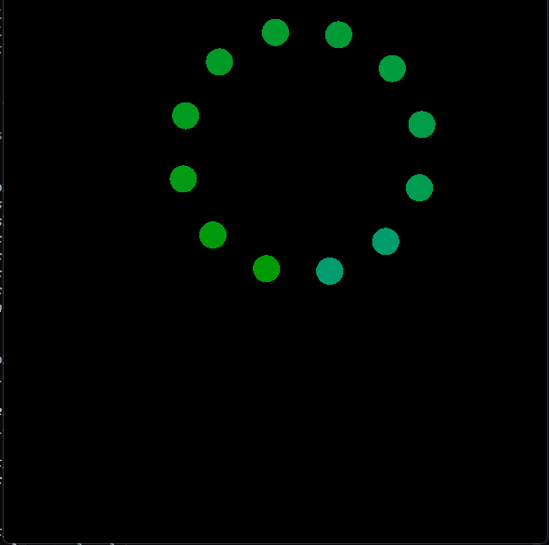
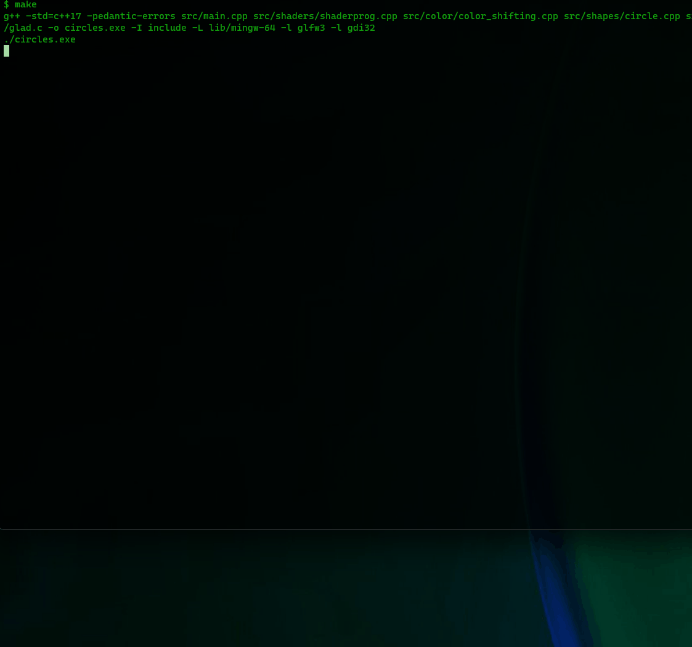

# Overview

This is another stint into OpenGL, but using C++ instead of Lisp on Windows.

This repo assumes a Windows 10/11 OS on 64 bit. I don't want to use Visual Studio, or its build tools, so I'll be utilizing MinGW's gcc/g++ (MinGW-64).

This README may not include everything needed to get this compiled on your architecture, or my targeted architecture. This can be resolved with a little bit of elbow-grease, but I will do my best to keep this file updated if I don't get too caught up in the creation of this program.

As you may notices, this repo's name insinuates that there will be more circles. That's the goal, but I feel pretty accomplished getting this repo to the point where it's at.

## Where It's at currently

This will likely need to be combed through with a debugger and a profiler to make sure I'm not abusing memory. This can be run via CLI, but clickinng on the executable doesn't work and gives an error.

I would like to resolve this, and then get this to a point where this can run on Linux and Windows.

Pretty much Finished:

## Dependencies - Local

* glm

I think this could be a system dependency instead if wanted, and can install, but I decided to add a git submodule to the `modules/` dir.

Run: `make dependencies` after cloning w/modules, or after updating submodules.

## Dependencies - System

This section may not be needed for you, as I'm using an `includes/` and `lib/win64` directory that git will be tracking, but if you want to kaibosh this folder, and set it up yourself, then this section is for you. If not, then skip this section.

I've created a folder, `libs-and-headers` to throw libraries and headers into that would've been handled by Visual Studio. 

Dependencies in this section, `Dependencies - System` that are needed, will be put in the aforementioned directory.

### GLFW

Version:  3.3.9 (WIN64)

Go to [GLFW's download page](https://www.glfw.org/download.html) and grab the binaries for 64-bit Windows. Or whatever is appropriate for your system.

Unzip this wherever you like, take the contents and place them in the `libs-and-headers` directory. If you unzipped directly into `libs-and-headers`, and you get a crazy name like `glfw-3.3.9.bin.WIN64`, rename it to `glfw` (or don't, it's up to you).

Put everyting in `glfw's` `include/` dir into the project root's `include/` dir, and put the appropriate compiler lib folder into the project root's `lib/` dir.

Structure:
./
  .git
  ...
  libs-and-headers
    glfw/
      docs/
      include/
      lib-mingw-w64/
      ...
    ...
  src/
  ...

### GLAD

This is the permalink that was given for the setup I used following the instructions at the [creating a window portion of learnopengl](https://learnopengl.com/Getting-started/Creating-a-window#:~:text=configuration%20of%20GLFW.-,GLAD,-We%27re%20still%20not): [glad generated](https://glad.dav1d.de/#language=c&specification=gl&api=gl%3D4.6&api=gles1%3Dnone&api=gles2%3Dnone&api=glsc2%3Dnone&profile=compatibility&loader=on).

If I did things correctly, and you're on a similar architecture, this should work for you as well.

Follow the instructions left for the glad portion after downloading the zip file.

It's up to you if you want to put it in the `libs-and-headers` dir, or just put it straight into your `includes` folder.

Structure:
./
  ...
  libs-and-headers/
    glad/
      include/
      src/
      ...
    ...
  ...

## Other Resources

* https://www.khronos.org/opengl/wiki/Main_Page
* https://learnopengl.com/Introduction
